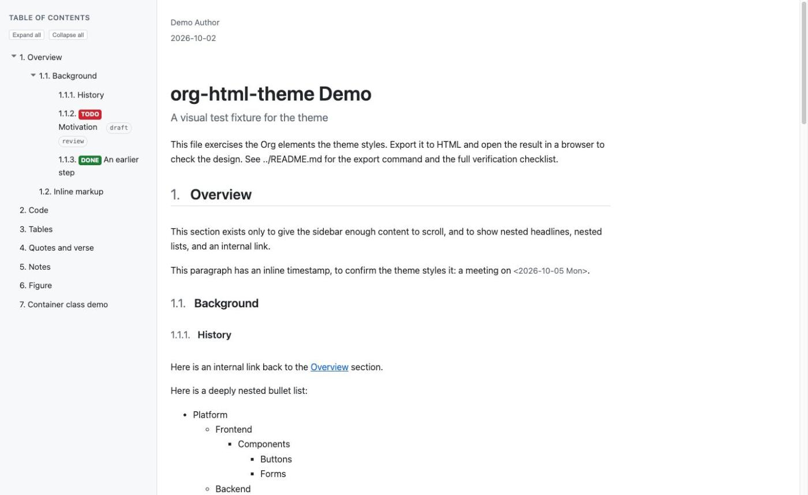
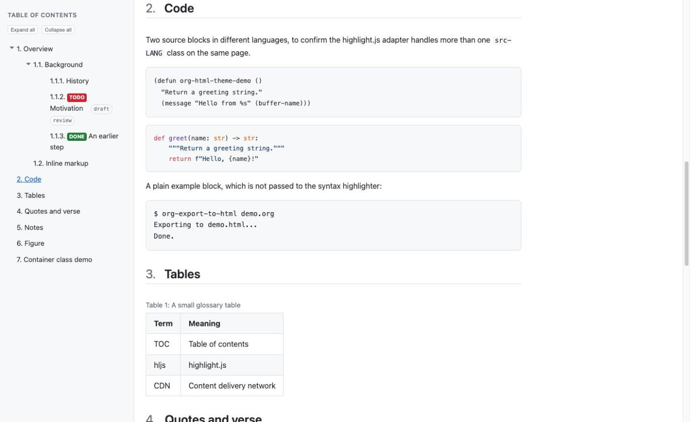
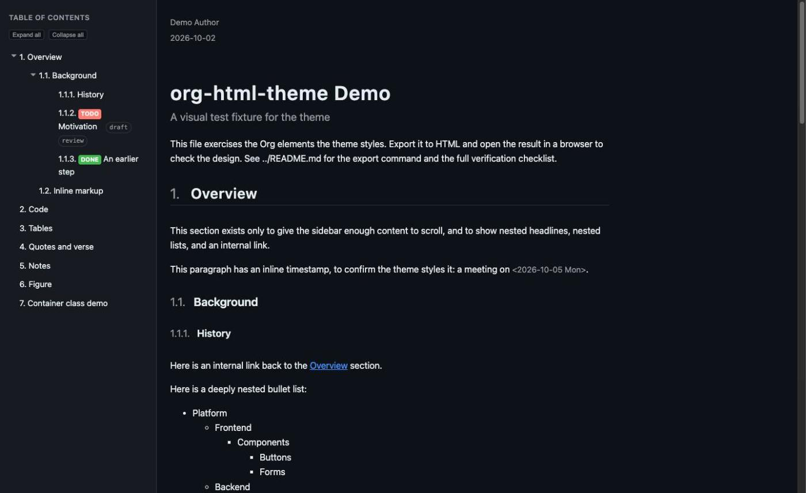
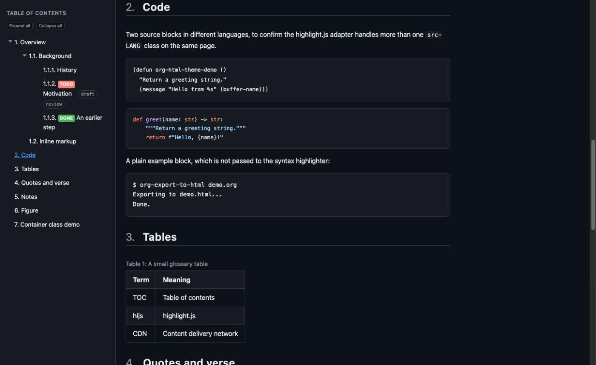

# org-html-theme

A simple, modern, responsive theme for Emacs Org-mode's HTML export
(`ox-html`). It has one design, with three parts:

- a fixed sidebar table of contents.
- a syntax-highlighted code block style, powered by
  [highlight.js](https://highlightjs.org/).
- a dark mode that follows the reader's operating system setting.
- LaTeX math, through Org's own built-in MathJax support. No setup needed.
- a print stylesheet, for "Print to PDF" and paper.

This project has no build step and no dependencies to install. It contains
only plain `.css`, `.js`, and `.org` files.

**[Live demo](https://arthurian.github.io/org-html-theme/)**. It is the
same `examples/demo.org` file, exported with the theme's own published
`#+SETUPFILE:` line and hosted on GitHub Pages from `docs/index.html`.

All four screenshots below render the same file.





Dark mode, shown next, needs no setup of its own. The browser applies it
based on the reader's system appearance.





Both pairs come from the same file.

## Files

```
org-html-theme/
├── LICENSE
├── README.md
├── theme.setup        # the #+SETUPFILE: target for your own .org files
├── theme-local.setup  # the same, but for local testing (see Develop below)
├── css/theme.css      # the stylesheet
├── js/theme.js        # the syntax-highlighting adapter and sidebar toggle
└── examples/demo.org  # a test fixture that exercises every styled element
```

## Use this theme

Add one line near the top of any `.org` file:

```org
#+SETUPFILE: "https://cdn.jsdelivr.net/gh/arthurian/org-html-theme@v0.1.2/theme.setup"
```

Org's `#+SETUPFILE:` keyword accepts a URL directly, so this line needs no
local clone of this repo at all, on any machine. [jsdelivr](https://www.jsdelivr.com/)
serves `theme.setup` and the `css/theme.css` and `js/theme.js` files it
links to straight from this GitHub repo, each pinned to the `v0.1.2` tag.

This means exporting a `.org` file needs internet access, the same
requirement the highlight.js CDN link already has. A tag, once pushed, never
changes, so your exported pages keep looking the same even after this repo
moves on. See "Release an update" below for how to move to a newer tag.

For a copy that does not depend on jsdelivr, clone this repo. Copy
`css/theme.css`, `js/theme.js`, and `theme.setup` into your own project.
In your copy of `theme.setup`, change the two CDN lines to relative paths
instead. Point them at `css/theme.css` and `js/theme.js`, wherever you put
those files.

## One Emacs prompt on first export

Org's `org-resource-download-policy` defaults to `prompt`. The first time
you export a file using the remote `#+SETUPFILE:` line above, Emacs asks
whether to download it from `cdn.jsdelivr.net`. Approve it.

A batch or scripted export has no one to answer that prompt. Org then
treats it as "no" and silently skips the whole setup file. A scripted
pipeline needs this line first instead:

```elisp
(setq org-resource-download-policy t)
```

To skip the interactive prompt every time instead, trust this one source
permanently:

```elisp
(add-to-list 'org-safe-remote-resources
             "\\`https://cdn\\.jsdelivr\\.net/gh/arthurian/org-html-theme@")
```

## Release an update

The CDN URLs are pinned to a tag. A change to `css/theme.css` or
`js/theme.js` has no effect on anyone using this theme until you push a new
tag. After committing a change, create and push one:

```sh
git tag v0.1.3
git push origin main v0.1.3
```

Then update the tag name to match in `theme.setup`'s two `jsdelivr.net`
lines, one `#+HTML_HEAD:` line (the CSS) and one `#+HTML_HEAD_EXTRA:` line
(the JS). Leave the two `cdnjs.cloudflare.com` lines alone. Those track the
highlight.js version instead, not this theme's own tag. Update the
`#+SETUPFILE:` example above too.

`docs/index.html`, the live demo, is a static snapshot. A tag change does
not update it on its own. Regenerate it from `examples/demo.org`, pointed
at the new tag, and commit the result alongside the rest of this release:

```sh
emacs --batch \
  --eval "(require 'ox-html)" \
  --eval "(setq org-export-allow-bind-keywords t)" \
  --eval "(setq org-resource-download-policy t)" \
  --visit=examples/demo.org --funcall org-html-export-to-html
```

Copy the result to `docs/index.html`. Replace its `#+SETUPFILE:` line with
the published CDN URL at the new tag. Point its intro paragraph's link at
this repository. Commit everything together, then push.

## One required Emacs setting

`theme.setup` includes this line:

```org
#+BIND: org-html-htmlize-output-type nil
```

This line tells Org to export plain code blocks that highlight.js can read,
instead of baking your local Emacs theme's colors into the HTML. By default,
Org blocks this kind of per-file setting for safety. You have two ways to
allow it.

- Add `(setq org-export-allow-bind-keywords t)` to your Emacs configuration.
  This allows `#+BIND` in every file you export, with no further prompts.
- Approve the safety prompt Emacs shows each time you open a file that uses
  `#+BIND`, without changing your configuration.

As a simpler path that avoids `#+BIND` entirely, add this line to your Emacs
configuration instead:

```elisp
(setq-default org-html-htmlize-output-type nil)
```

## highlight.js version and dark mode

`theme.setup` loads highlight.js version `11.9.0` from the cdnjs CDN
(content delivery network). The version is pinned in the URL, not
`latest`, so an update to highlight.js never changes your exported pages
without your choice. To use a newer version, edit all three cdnjs URLs in
`theme.setup` to match: two stylesheets and one script.

The two stylesheets are a light and a dark highlight.js color theme,
"github" and "github-dark". Each `<link>` tag carries a `media` attribute,
`(prefers-color-scheme: light)` or `(prefers-color-scheme: dark)`, so the
browser loads only the one that matches. This needs no JavaScript. It
follows the same system setting as the rest of the page.

## Author and date near the title

By default, Org's HTML export only shows the author and date in the page
footer, never next to the title. `theme.setup` adds one more line to also
show them above the title, near the top of the page:

```org
#+BIND: org-html-preamble-format (("en" "<p class=\"author\">%a</p>\n<p class=\"date\">%d</p>\n"))
```

One difference from the footer version: `#+OPTIONS: author:nil` or
`date:nil` turns the matching line off in the footer. The preamble line
always shows both instead, because a custom format string skips that test.
To turn off the top placement only, delete this `#+BIND` line from
`theme.setup`. You can also override it with your own `#+BIND` line in a
single `.org` file.

## Math

Write LaTeX math in your `.org` file, inline as `\(e^{i\pi} + 1 = 0\)` or
as a display equation. Org detects it and adds [MathJax](https://www.mathjax.org/)
to the page on its own, with no line needed in `theme.setup` and no
`#+OPTIONS` to set. A file with no math loads no MathJax script at all.

## Print to PDF

The stylesheet includes a `@media print` block, used automatically by
"Print" or "Print to PDF" in your browser. It makes three changes.

- It forces light, ink-sparing colors on paper, no matter the screen's
  current mode. A dark background belongs on a screen, not in a PDF.
- It turns the fixed sidebar into a normal table of contents ahead of the
  content, instead of hiding it. Every section prints expanded, no matter
  what is collapsed on screen.
- It removes controls that only make sense on screen: the TODO sidebar
  toggle, the expand/collapse-all buttons, each section's toggle arrow,
  and the sidebar resize handle.

## Known limitations

- **Only the two base TODO classes are styled.** Org always emits `.todo`
  and `.done`, and this theme styles both. Org also emits a class named
  after each custom keyword you define, such as `.WAITING`. Those keyword
  classes are unstyled here, because keyword sets vary per user. Add your
  own rule for a custom keyword with an extra `#+HTML_HEAD_EXTRA:` line in
  your `.org` file.
- **No scroll-based active-section highlighting.** The sidebar does not
  highlight the section you are currently reading. A manual dark-mode
  toggle is still a possible future addition, not part of this version.
- **Nothing is remembered between page loads.** You can drag the sidebar's
  right edge to resize it. You can also collapse sections of the nested
  TOC tree. Both reset to their defaults on the next page load. Saving
  either choice needs `localStorage`, which this theme does not use.

## Develop this theme

`examples/demo.org` uses `theme-local.setup`, not `theme.setup`. It points
`css/theme.css` and `js/theme.js` at your local clone of this repo, with
relative paths. A change to either file shows up the next time you export
`demo.org`, with no need to push a tag first. `theme-local.setup` is not
meant for your own `.org` files. Use `theme.setup` for those, as shown
above.

## Verify a change

There is no automated test suite for a static theme. Verification is
manual.

1. Export `examples/demo.org` to HTML with a running Emacs server, for
   example through the `emacsclient` command.
2. Open the exported `demo.html` file in a browser. Confirm the sidebar
   layout, the code block highlighting, the table, the blockquote, the
   footnote, the verse block, and the figure all look correct.
3. Resize the browser below 768 pixels wide. Confirm the sidebar toggle
   button appears and works.
4. Turn on dark mode, either in your OS appearance setting or your
   browser's developer tools. Confirm the page re-themes without a reload,
   and confirm the code blocks switch to a dark syntax theme too.
5. Click a toggle arrow next to a sidebar entry that has sub-headings.
   Confirm its nested list collapses and expands again on a second click.
6. Click "Collapse all" above the sidebar list. Confirm every entry with
   sub-headings collapses. Click "Expand all". Confirm they all reopen.
7. Drag the thin strip at the sidebar's right edge. Confirm the sidebar,
   the title area, and the main content all resize together.
8. Open your browser's print preview. Confirm the sidebar reflows above
   the content as a plain table of contents. Confirm every section shows
   expanded. Confirm the code blocks print in plain black text, not a
   syntax color theme.
9. Confirm the Math section renders an inline equation and a numbered
   display equation, not raw LaTeX text.

## Credit

This theme takes architectural inspiration, not code, from the "material"
theme in the [fniessen/org-html-themes](https://github.com/fniessen/org-html-themes)
project. It borrows that theme's use of CSS custom properties, vanilla
JavaScript, and a responsive sidebar.
